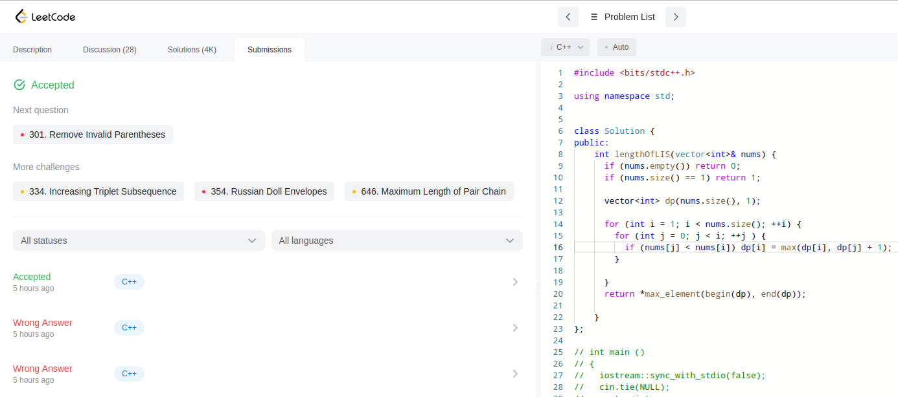
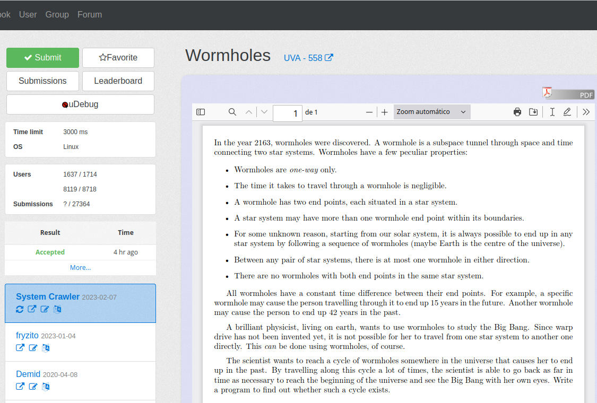
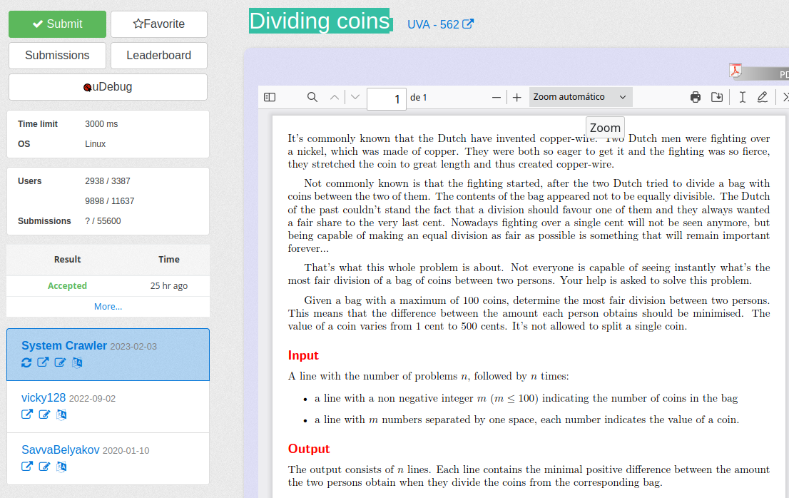
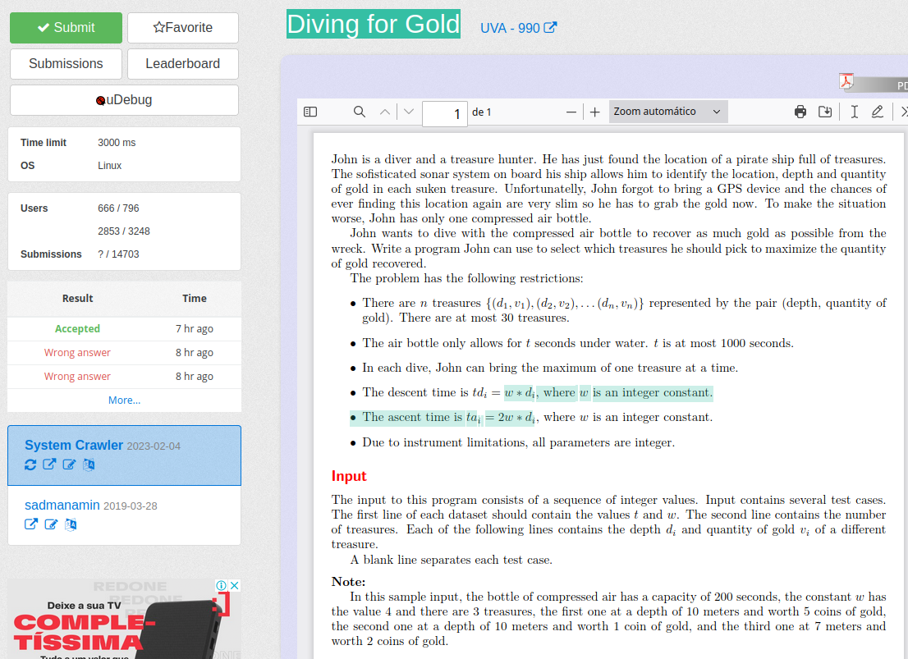

Temas:
 - PD
 

# PD_Questões

**Número da Lista**: 22 
**Conteúdo da Disciplina**: Programação Dinâmica 

## Alunos
|Matrícula | Aluno |
| -- | -- |
| 19/0047968 |  Paulo Abi Acl      |
| 16/0000572 |  Adrian Soares Lopes|

## Sobre 

Neste projeto você encontra um  conjunto de questões resolvidas para aplicação dos
conceitos de Programação Dinâmica. Reune algumas questões de juízes eletrônicos

## Screenshots

LeetCode: 300. Longest Increasing Subsequence

OJ558: Wormholes

OJ562: Dividing coins 

OJ990: Diving for Gold

## Instalação 
**Linguagem**: C++ 

Você precisa do C++>=17 e da ferramenta `make` mais atualizada caso queira utilizar os `Makefile`'s' 

## Uso 

Basta utilizar os códigos e os juízes eletrônicos para testar. Caso queira tentar alguns dos exercício, os nomes das pastas são os códigos para os exercícios.

## Apresentação

[Link da apresentação](https://raw.githubusercontent.com/projeto-de-algoritmos/PD_Dupla22_Questoes/master/General-20230206_235533-Grava%C3%A7%C3%A3o%20de%20Reuni%C3%A3o.mp4)
